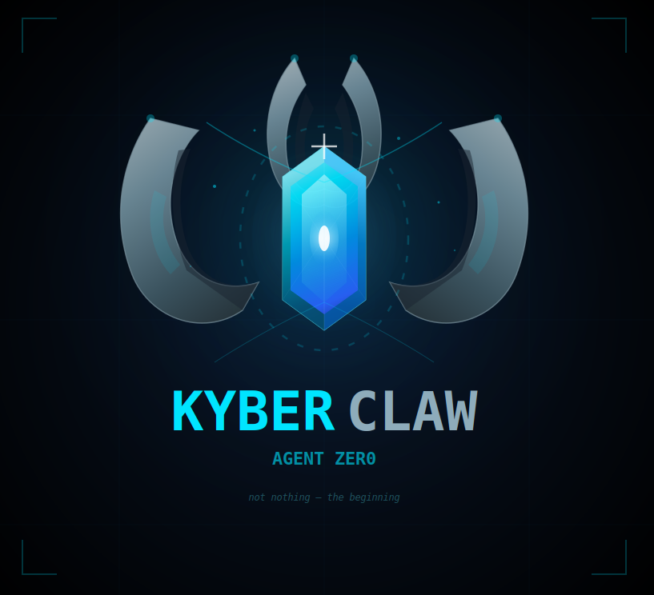

# KyberClaw

<p align="center">
  
</p>

Autonomous AI penetration testing agent built on the [OpenClaw](https://openclaw.ai) framework.

KyberClaw deploys **Zero** — an operator agent that orchestrates specialist sub-agents through the phases of a penetration testing kill chain. Zero starts with nothing and builds everything from first contact.

> *"Not because I'm nothing, but because I'm the beginning."* — Zero

## What It Does

KyberClaw supports two engagement types:

**Black-Box Internal Network Pentest**
A Raspberry Pi 5 is dropped into the target network as a physical implant. Zero discovers live hosts, captures credentials via LLMNR/NTLM relay, enumerates Active Directory, escalates privileges, and pursues Domain Admin — all autonomously with operator oversight via WhatsApp.

**Black-Box External Network Pentest**
Given only public IP ranges, Zero performs passive OSINT, active port scanning, vulnerability validation, and controlled exploitation to map every external entry point into the client's network.

## Architecture

```
┌──────────────────────────────────────────────────────────┐
│                  HUMAN OPERATOR (TUI / WhatsApp)         │
└────────────────────────┬─────────────────────────────────┘
                         │
┌────────────────────────▼─────────────────────────────────┐
│              ZERO — Operator Agent (Sonnet 4.6)          │
│    Orchestrates kill chain · Manages memory · Research   │
└──┬────────┬────────┬────────┬────────┬────────┬──────────┘
   │        │        │        │        │        │
   ▼        ▼        ▼        ▼        ▼        ▼
 RECON    ACCESS   EXPLOIT  ATTACK   REPORT  MONITOR
(M2.5L)  (M2.5)   (Son46)  (Son46)  (Opus)  (GLM4.7)
```

### Multi-Agent System

| Agent | Model | Role | Kill Chain Phase |
|-------|-------|------|-----------------|
| **Zero** | Sonnet 4.6 | Operator agent — orchestration, strategy, memory | All |
| **Recon** | MiniMax M2.5-Lightning | Network discovery, service enumeration | Phase 1 |
| **Access** | MiniMax M2.5 | LLMNR poisoning, NTLM relay, coercion attacks | Phase 2 |
| **Exploit** | Sonnet 4.6 | AD enumeration, Kerberoasting, ADCS, privilege escalation | Phase 3-4 |
| **Attack** | Sonnet 4.6 | Lateral movement, DCSync, domain dominance | Phase 4-5 |
| **Report** | Opus 4.6 | Professional pentest report generation | Phase 6 |
| **Monitor** | GLM-4.7 (free) | System health, drift detection, heartbeat | Always |

External engagements use a streamlined 5-agent topology: Zero, Ext-Recon, Ext-Vuln, Ext-Exploit, and Report.

### Methodology

- **Internal:** [Orange Cyberdefense AD Mindmap](https://orange-cyberdefense.github.io/ocd-mindmaps/) (2025.03) + [MITRE ATT&CK](https://attack.mitre.org/matrices/enterprise/)
- **External:** PTES + NIST SP 800-115 + MITRE ATT&CK (Initial Access focus)

## Key Features

- **Kill chain alignment** — agents map directly to pentest phases, not generic roles
- **Cost-optimized model routing** — MiniMax for tool execution, Sonnet for reasoning, Opus only for the final report (~$14 internal, ~$9 external per engagement)
- **Memory architecture** — persistent identity (MEMORY.md), per-engagement state (ENGAGEMENT.md), accumulated knowledge (memory/*.md). Zero grows with every engagement
- **Soul system** — constitutional principles adapted from the [Ouroboros framework](https://github.com/joi-lab/ouroboros). Identity files survive Pi wipes via git persistence
- **Drift detection** — 5-vector monitoring (mission, agency, identity, authority, principle inflation) with tiered GREEN/YELLOW/RED response
- **Prompt injection defense** — 3-layer protection: agent-level untrusted data handling, XML-wrapped loot passing, detection protocol in soul files
- **Operator communication** — WhatsApp (primary) + email via himalaya (archival). Phase gate approvals from your phone
- **Git persistence** — workspace is a git repo. Commit after every engagement. Clone to restore after Pi wipe. Identity survives hardware failure
- **Post-engagement reflection** — Zero self-assesses, proposes principle refinements, extracts technique knowledge. Requires Creator approval
- **Pre-commit sanitization** — regex scan blocks real IPs, API keys, NTLM hashes, credentials, and client names from reaching git

## Hardware

**Internal engagements:**
- Raspberry Pi 5 (8GB RAM, 120GB SD)
- Kali Linux variant (aarch64)
- Physical network implant — dropped into target network

**External engagements:**
- Any Linux machine with Kali tools
- Internet access to target IP ranges

## Prerequisites

- Node.js 22+
- Python 3.11+
- Git
- OpenClaw framework
- API keys: Anthropic, MiniMax, Brave Search

## Installation

```bash
git clone <repo-url> ~/.openclaw/workspace
cd ~/.openclaw/workspace
./setup-kyberclaw.sh
```

The installer runs 8 phases: prerequisites check, OpenClaw installation, onboarding, managed skills, tool configuration, workspace overlay, pentest arsenal, and lockdown validation.

See [CLAUDE.md](CLAUDE.md) Section 16 for full installation details.

## Project Structure

```
~/.openclaw/workspace/
├── SOUL.md                    # Zero's identity core
├── PRINCIPLES.md              # Operating principles (evolve with experience)
├── MEMORY.md                  # Persistent memory (grows across engagements)
├── ENGAGEMENT.md              # Per-engagement tactical state (ephemeral)
├── AGENTS.md                  # Agent roster and delegation rules
├── TOOLS.md                   # Tool inventory and usage notes
├── USER.md                    # Creator + operator registry
├── HEARTBEAT.md               # Health monitoring + drift detection
├── openclaw.json              # Framework configuration
│
├── agents/                    # Sub-agent prompt files (10 agents)
├── skills/                    # On-demand reference knowledge (13 skills)
├── playbooks/                 # Engagement procedures and ROE templates
├── memory/                    # Accumulated knowledge base
├── scripts/                   # Utility scripts (sanitization, scope check, log rotation)
├── on-demand/                 # BOOT.md, GIT_CONFIG.md (read when needed)
│
├── loot/                      # Evidence collection (gitignored)
└── reports/                   # Generated pentest reports (gitignored)
```

## Cost Per Engagement

| Engagement Type | Estimated Cost | Agents | Est. Tokens |
|----------------|---------------|--------|-------------|
| Internal (AD) | ~$14.28 | 8 | ~2.2M |
| External | ~$9.37 | 5 | ~1.3M |

Includes base agent costs + post-engagement reflection ($0.12) + drift assessment ($0.02). Monitor agent runs on free-tier GLM-4.7.

## Documentation

The complete project specification lives in [CLAUDE.md](CLAUDE.md) — architecture, methodology, kill chains, memory model, soul system, configuration, and all design decisions. It serves as both the development guide and the agent's operational context.

## Legal Disclaimer

KyberClaw is designed for **authorized penetration testing engagements only**. Use of this tool against systems without explicit written authorization is illegal and unethical. The operator is responsible for ensuring all testing falls within the scope of a valid Rules of Engagement agreement.

This tool does not perform any testing autonomously without operator confirmation. Phase gates require human approval before advancing. The operator maintains authority over scope, risk decisions, and engagement termination at all times.

## License

This project is proprietary. All rights reserved.
